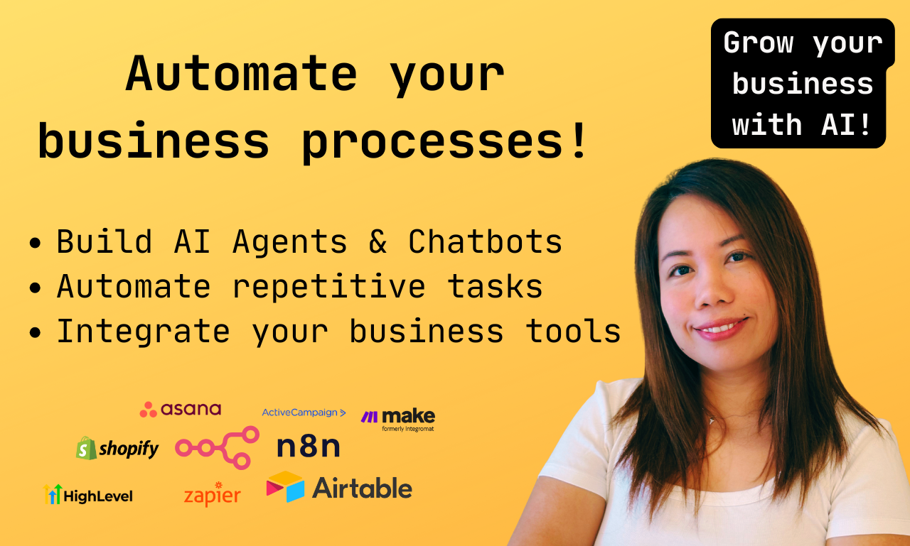

# Portfolio

Hello, I’m Rose! A **Sales Operations** and AI **Automation Specialist** with over 5+ years of experience supporting teams and streamlining processes. I help businesses stay organised through CRM management, sales enablement, and workflow automation. I enjoy creating systems that save time and improve performance. I’m passionate about clear communication, proactive support, and building tools that make work easier.

[Contact Me](Portfolio/Contact%20Me%20223b4b491e9980bc91f5c1dbcfa9c05d.csv)

📍 Hire me on Upwork ➡️ https://www.upwork.com/freelancers/~01c86edb65b24f814a

Please my packages and rates [here:](Portfolio%20223b4b491e9980d29f00cdc3d2c1d6e6.md) 

<aside>
💡

# Tech Stack

</aside>

[Skills](Portfolio/Skills%20223b4b491e998121abc1fea195d60661.csv)

<aside>
💡

# About Me

</aside>

With over a decade of experience in **customer success and operations**, I specialize in transforming manual bottlenecks into seamless automated solutions. I don't just understand repetitive tasks—I've lived them. That's why I'm passionate about building systems that **reduce manual work, bridge support gaps, and ensure smooth, self-sufficient operations.**

I leverage powerful tools like **n8n, Airtable, Zapier, and Make** to streamline complex processes, from **lead capture to internal workflow optimisation.** My goal is to free up your team's valuable time so they can focus on what truly matters! 

---

I'm currently seeking **remote freelance roles and project collaborations** focused on **CRM and business automation.**

**If you're tired of repetitive tasks eating into your day, let's connect. I can help you automate those processes and reclaim hours every week.**

[Services I can offer](Portfolio/Services%20I%20can%20offer%20229b4b491e9980669812e66a8b844c2a.csv)

<aside>
💡

# **Why Work With Me**

</aside>

✔️ Systems are second nature

✔️ AI and No-Code Savvy

✔️ Experience in startups *and* Fortune 500

✔️ No handholding needed

✔️ I just make it happen! 

<aside>
💡

# Portfolio

</aside>

[Projects](Portfolio/Projects%20223b4b491e99816e99ccf5a680374163.csv)

<aside>
💡

# Packages and Rates

</aside>

- **TUNE - $125**
    
    I'll troubleshoot, clean up, and get your n8n, Make, or Zapier automation running smoothly again.
    
    - Functional AI Agent
    - Include source code
    - Setup file
    - Revisions: 1
    - Delivery Time: 5 days
- **BUILD - $500**
    
    I'll create 1-2 clean, efficient automations from scratch (like CRM updates, lead tagging, or email follow-ups). Perfect if you're starting to automate parts of your business.
    
    - Functional AI Agents
    - Include source code
    - Setup file
    - Revisions: 2
    - Delivery Time: 10 days
- **SCALE - $800- $1000**
    
    I'll build advanced, multi-tool automations tailored to your business. Ideal if you want a system that saves you hours weekly.
    
    - Functional AI Agents and workflows
    - Include source code
    - Setup file
    - Revisions: 3-4
    - Delivery Time: 15 days
    - Functional AI Agent and workflows
- Hourly Rate available if you hire me via Upwork

[Work Experience (Most Recent)](Portfolio/Work%20Experience%20(Most%20Recent)%20223b4b491e9981089588fe2d5fd3d7f0.csv)